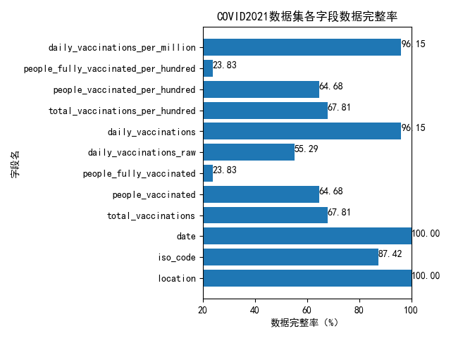
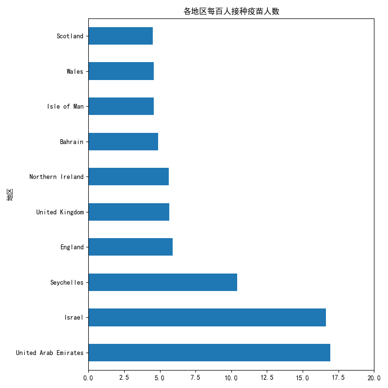

<center><font size=6>数据可视化作业二报告</font></center>
<center><font size=4>202000300349 郑嘉骏 大数据1班</font></center>

## 选题内容与背景

作为数据可视化第二次作业，要将探索式数据分析的结果进行可视化。因为近年来关于COVID-19疫情肆虐，所以决定在疫情这个领域进行数据分析。鉴于已经有较多的研究对国内感染人数、死亡人数等数据进行了分析，所以我打算另辟蹊径，从国际化角度来看问题，且关注的是疫苗的接种情况，考虑到未来的感染人数可能受疫苗接种率影响，所以对疫苗接种情况比较关注。题目推荐医疗大数据作为选题，这个方向也比较符合。

数据集来源：http://www.idatascience.cn/dataset-detail?table_id=448

## 开始研究

<center><font size=4>初步了解数据集</font></center>

首先看看数据集各个字段
|字段名称|字段类型|字段说明|
|:-:|:-:|:-:|
|location|字符型|地区|
|iso_code|字符型|iso编码。|
|date|字符型|日期。|
|total_vaccinations|浮点型|总接种量。|
|people_vaccinated|浮点型|接种疫苗的人。|
|people_fully_vaccinated|浮点型|已完全接种疫苗的人。|
|daily_vaccinations_raw|浮点型|每日接种原始疫苗。|
|daily_vaccinations|浮点型|每日疫苗接种。|
|total_vaccinations_per_hundred|浮点型|每百人接种总数。|
|people_vaccinated_per_hundred|浮点型|每百人接种疫苗的人数。|
|people_fully_vaccinated_per_hundred|浮点型|每百人完全接种疫苗的人数。|
|daily_vaccinations_per_million|浮点型|每百万人每天接种的疫苗。|

<center><font size=4>初步研究：数据集数据完整性</font></center>

首先拿到一个新的数据集，我们要看它是否有完整的数据，还是有许多空值。我们定义每个字段的数据完整率为非空值个数除以总个数乘100%。在```code/EDA0.py```中我先把各个字段的完整性先用柱状图可视化了，结果图片放到了```output/Integrity.png```中，如图：

可以看到，location、date这两个字段是百分之百的完整率，我们可以在这两个地方重点研究。另外注意到，有两个字段people_fully_vaccinated_per_hundred、people_fully_vaccinated数据完整率才在20%出头，这暗示我们不太能够在这两个字段上下文章。其余的字段完整率都较为可观。

<center><font size=4>研究问题一：地区会影响每百人疫苗接种人数吗</font></center>

很明显是会影响的，不过我们其实是想看看不同地区的接种率的异同。很明显各个国家人数不一样，比较总数有失偏颇，不如用每百人接种人数。根据常识得到，如果每百人接种疫苗人数多，说明当地政府和人民防疫意识较强，反之较弱。

在```code/EDA1.py```中将不同地区和每百人接种疫苗人数的关系可视化了，使用的依然是柱状图的形式，结果图片放到了```output/EDA1_1.png```，结果图片较长，如图：


这张图太大了，没法有很直观的认识，所以我截取了前十名又绘制了一张图，结果存在```output/EDA1_2.png```中。如图：



同时，我也在```output/EDA1.csv```中存放了精确的数据。鉴于该问题可视化的国家太多，所以我们先挑几个比较关注的分析。首先让我震惊的是，根据```output/EDA1.csv```中的数据，中国每一百人的疫苗接种人数为0.554人。这个数据在排名中不算具有优势。我进行了简要分析，认为是以下原因：

1. 疫苗未能普及中国所有省份或地区，因为采集数据时间段在2021年1月初，疫苗可能刚刚研发成功。
2. 中国人口基数大，虽然接种疫苗人数很多，但是由于超大的总人数导致每百人接种人数低。
3. 缺乏采样数据。在```data/COVID2021.csv```中，我发现location为China的行中people_vaccinated_per_hundred列的数据十分匮乏，有许多都是NULL值，因此求平均时存在较大误差。

我个人认为有可能是第二个原因，因此这启发我们探讨接种总数的问题，也就是等一下要研究的问题二。

再看看其他地区的数据，每百人接种人数最多的国家是Gibraltar（直布罗陀），约有18.9人每百人。我在网上搜索了一下，该国家占地面积6.54平方千米，看得出来国家较小，又因为在欧洲地区，所以每百人接种人数较高也有了好的解释。这进一步证明了仅看接种占比是不合理的，我们需要看接种的总数。

<center><font size=4>研究问题二：每日接种疫苗总数最多的前十个国家以及每日消耗的疫苗数量占比</font></center>

虽然中国凭借着庞大的人口基数在消耗疫苗总数上占有优势，但是我们还是能根据这个问题侧面反映出一个国家的医疗基础能力和医疗抗压能力。

#### 第一小问：每日疫苗接种数最多的前十个国家

我在```code/EDA2.py```中提取出每个国家平均每天的疫苗接种数，然后存入```output/EDA2.csv```中，考虑到研究问题一时图片太长，所以只考虑排名前十的国家。并将可视化结果放入```output/EDA2_1.png```中。如图：


看的出来，每日接种疫苗数最多的国家是美国，其次是中国，再次之是欧盟。在这个排名中中国就相当靠前了，每日接种33万多，说明我国也是有一定的医疗实力。至于为何中国和美国接种数量差异较大，我认为有以下几点原因。

1. 国内医疗科研水平与美国水平差距较大，不能快速地研发出高质量疫苗。国内疫苗研发时间线滞后于美国。
2. 美国部分地区疫情暴发，美国民众对新冠病毒的忧患意识更高，更有接种意愿。

以上两个问题都是和地区有关的接种信息可视化。我们认识到（2021年1月初）虽然我国疫苗接种数量大，但人均接种数少，可能存在疫苗资源普及率不高的情况。同时，疫苗研究的时效性有待改善。

#### 第二小问：每日疫苗接种数各国占比

我们已经得到了所有国家对应的数据，所以接下来只要绘制出一个饼图即可。在代码```code/EDA2.py```的后半部分中，我绘制了饼状图，结果存在```output/EDA2_2.png```，如图：


看得出来除了美国、中国、欧盟三个国家外，其他的国家占比都较少。

<center><font size=4>研究问题三：</font></center>