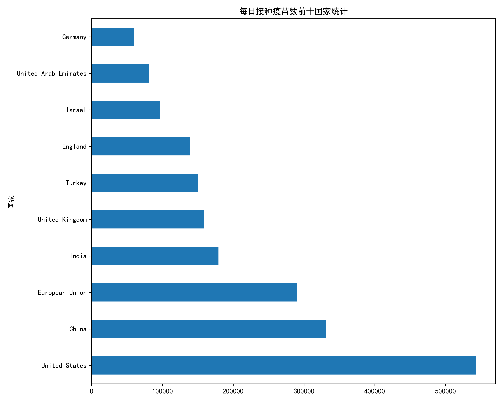
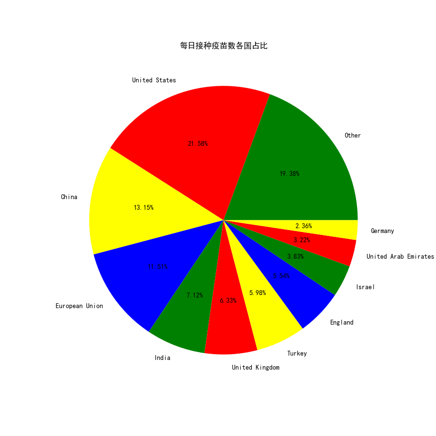
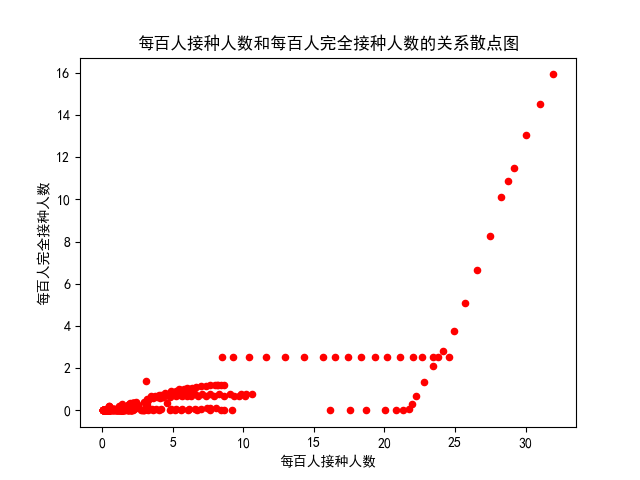
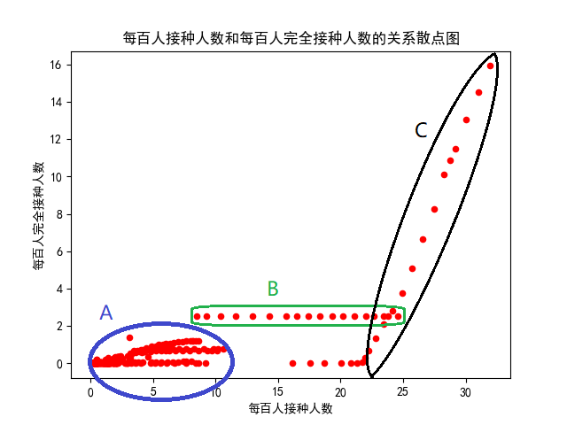

---
puppeteer:
  landscape: true
  format: 'A4'
---
<center><font size=6>数据可视化作业二报告</font></center>
<center><font size=4>202000300349 郑嘉骏 大数据1班</font></center>

## 选题内容与背景

作为数据可视化第二次作业，要将探索式数据分析的结果进行可视化。因为近年来关于COVID-19疫情肆虐，所以决定在疫情这个领域进行数据分析。鉴于已经有较多的研究对国内感染人数、死亡人数等数据进行了分析，所以我打算另辟蹊径，从国际化角度来看问题，且关注的是疫苗的接种情况，考虑到未来的感染人数可能受疫苗接种率影响，所以对疫苗接种情况比较关注。题目推荐医疗大数据作为选题，这个方向也比较符合。

数据集来源：http://www.idatascience.cn/dataset-detail?table_id=448

本作业代码仓在2022年5月2日开源，开源网址在[https://github.com/RoundedOrange/EDAAssignment](https://github.com/RoundedOrange/EDAAssignment)。遵循GPL第三版协议。根目录下有README.md文件。

本作业代码全由python编程实现。

## 初步了解数据集

首先看看数据集各个字段
|字段名称|字段类型|字段说明|
|:-:|:-:|:-:|
|location|字符型|地区|
|iso_code|字符型|iso编码。|
|date|字符型|日期。|
|total_vaccinations|浮点型|总接种量。|
|people_vaccinated|浮点型|接种疫苗的人。|
|people_fully_vaccinated|浮点型|已完全接种疫苗的人。|
|daily_vaccinations_raw|浮点型|每日接种原始疫苗。|
|daily_vaccinations|浮点型|每日疫苗接种。|
|total_vaccinations_per_hundred|浮点型|每百人接种总数。|
|people_vaccinated_per_hundred|浮点型|每百人接种疫苗的人数。|
|people_fully_vaccinated_per_hundred|浮点型|每百人完全接种疫苗的人数。|
|daily_vaccinations_per_million|浮点型|每百万人每天接种的疫苗。|

## 初步研究：数据集数据完整性

首先拿到一个新的数据集，我们要看它是否有完整的数据，还是有许多空值。我们定义每个字段的数据完整率为非空值个数除以总个数乘100%。在```code/EDA0.py```中我先把各个字段的完整性先用柱状图可视化了，结果图片放到了```output/Integrity.png```中，如图：

可以看到，location、date这两个字段是百分之百的完整率，我们可以在这两个地方重点研究。另外注意到，有两个字段people_fully_vaccinated_per_hundred、people_fully_vaccinated数据完整率才在20%出头，这暗示我们不太能够在这两个字段上下文章。其余的字段完整率都较为可观。

## 研究问题一：地区会影响每百人疫苗接种人数吗

很明显是会影响的，不过我们其实是想看看不同地区的接种率的异同。很明显各个国家人数不一样，比较总数有失偏颇，不如用每百人接种人数。根据常识得到，如果每百人接种疫苗人数多，说明当地政府和人民防疫意识较强，反之较弱。

在```code/EDA1.py```中将不同地区和每百人接种疫苗人数的关系可视化了，使用的依然是柱状图的形式，结果图片放到了```output/EDA1_1.png```，结果图片较长，如图：


这张图太大了，没法有很直观的认识，所以我截取了前十名又绘制了一张图，结果存在```output/EDA1_2.png```中。如图：


同时，我也在```output/EDA1.csv```中存放了精确的数据。鉴于该问题可视化的国家太多，所以我们先挑几个比较关注的分析。首先让我震惊的是，根据```output/EDA1.csv```中的数据，中国每一百人的疫苗接种人数为0.554人。这个数据在排名中不算具有优势。我进行了简要分析，认为是以下原因：

1. 疫苗未能普及中国所有省份或地区，因为采集数据时间段在2021年1月初，疫苗可能刚刚研发成功。
2. 中国人口基数大，虽然接种疫苗人数很多，但是由于超大的总人数导致每百人接种人数低。
3. 缺乏采样数据。在```data/COVID2021.csv```中，我发现location为China的行中people_vaccinated_per_hundred列的数据十分匮乏，有许多都是NULL值，因此求平均时存在较大误差。

我个人认为有可能是第二个原因，因此这启发我们探讨接种总数的问题，也就是等一下要研究的问题二。

再看看其他地区的数据，每百人接种人数最多的国家是Gibraltar（直布罗陀），约有18.9人每百人。我在网上搜索了一下，该国家占地面积6.54平方千米，看得出来国家较小，又因为在欧洲地区，所以每百人接种人数较高也有了好的解释。这进一步证明了仅看接种占比是不合理的，我们需要看接种的总数。

## 研究问题二：每日接种疫苗总数最多的前十个国家以及每日消耗的疫苗数量占比

虽然中国凭借着庞大的人口基数在消耗疫苗总数上占有优势，但是我们还是能根据这个问题侧面反映出一个国家的医疗基础能力和医疗抗压能力。

### 第一小问：每日疫苗接种数最多的前十个国家

我在```code/EDA2.py```中提取出每个国家平均每天的疫苗接种数，然后存入```output/EDA2.csv```中，考虑到研究问题一时图片太长，所以只考虑排名前十的国家。并将可视化结果放入```output/EDA2_2.png```中。如图：



看的出来，每日接种疫苗数最多的国家是美国，其次是中国，再次之是欧盟。在这个排名中中国就相当靠前了，每日接种33万多，说明我国也是有一定的医疗实力。至于为何中国和美国接种数量差异较大，我认为有以下几点原因。

1. 国内医疗科研水平与美国水平差距较大，不能快速地研发出高质量疫苗。国内疫苗研发时间线滞后于美国。
2. 美国部分地区疫情暴发，美国民众对新冠病毒的忧患意识更高，更有接种意愿。

以上两个问题都是和地区有关的接种信息可视化。我们认识到（2021年1月初）虽然我国疫苗接种数量大，但人均接种数少，可能存在疫苗资源普及率不高的情况。同时，疫苗研究的时效性有待改善。

### 第二小问：每日疫苗接种数各国占比

我们已经得到了所有国家对应的数据，所以接下来只要绘制出一个饼图即可。在代码```code/EDA2.py```的后半部分中，我绘制了饼状图，结果存在```output/EDA2_2.png```，如图：



看得出来除了美国、中国、欧盟三个国家外，其他的国家占比都较少。

## 研究问题三：每百人接种疫苗的人数和每百人完全接种疫苗的人数有什么关系

我们不知道这两个变量有正相关关系还是负相关关系，或者没有显著关系。

在```code/EDA3.py```中，我绘制出了每百人接种人数和每百人完全接种人数的散点图，图片结果存在```output/EDA3_1.png```中。当然也把对应数据也存到了```output/EDA3.csv```中。先来看看图片：



很明显，从图中我们可以看出，有那么点关系，但好像并不是单一的关系。对于这些散点集，我们凭肉眼大概可以将其分为三个子集。第一个子集是$A=\{(x,y) | x\in [0,10],y\in [0,2]\}$。第二个子集是$B=\{(x,y)|x\in [7,25],y\in (2,3)\}$，第三个子集是$C=\{(x,y)|x\in [15,25],y\in (0,2)\}\cup\{(x,y)| x\in [25,30],y\in [3,16]\}$。我就直接在图上标出三个子集了。



我们接下来对这三个散点集进行分别分析。

### A集合

很明显，看得出来在每百人接种人数在$[0,10]$时，每百人完全接种人数并不受太大影响。这部分是十分可信的，因为我们在第一个研究问题中已经得到了结论：每百人接种人数的这些数据大部分都小于10的，所以这里的数据量很庞大，可信度高。

A集合内的结论为：当每百人接种人数小于等于10时（绝大多数情况），每百人完全接种人数不受其影响，值都在[0,2]之间。

### B集合

很明显可以把B集合的点回归的函数看成是满足一个不受每百人接种人数影响的函数。但注意到对应y值固定在2出头，通过查原数据集能发现B集合中的数据都是United Arab Emirates（阿联酋）国家的。因此将该国特别讨论。不过在这情况下每百人完全接种人数还是和每百人接种人数没什么关系。

B集合的结论为阿联酋国家每百人完全接种人数不受每百人接种人数影响，值大概在2出头。

### C集合

C集合内的数据很明显能发现是二者呈正相关关系，但通过查询原数据集发现这些数据都属于Isreal以色列这个国家的数据，所以以色列这个国家应该特别讨论。

C集合的结论为：以色列每百人接种人数和每百人完全接种人数是正相关的关系。

综上根据ABC三个集合的结论，我们整合一下就得到了研究问题三的总结论：除了阿联酋和以色列外，其他国家的每百人完全接种人数和每百人接种人数没有关系，每百人完全接种人数大多值小于2，每百人接种人数小于10.对于阿联酋，每百人完全接种人数和每百人接种人数也没关系，但是其每百人接种人数在[8,25]区间，每百人完全接种人数在2出头，这和普遍情况是不一样的。对于以色列，每百人完全接种人数和每百人接种人数是线性正相关关系，每百人接种人数在[23,30]区间，每百人完全接种人数在[0,16]区间。

至于为什么呈现这样的数据趋势，可能要结合不同国家的政策以及医疗方面的知识进行分析，我就不分析了。

## 总结与结论

我们首先根据题目要求选择了2021年各大国家的疫苗接种情况表，进行了初步了解、初步研究数据集，然后分析了三个研究问题，并获得了一些结论，形成了一些结果数据和可视化成果。

1. 初步了解这一步骤中，我们了解了数据集各个字段名称以及含义。
2. 初步研究数据集时，我们通过python得到该数据集各个字段的数据完整率，从而决定了我们接下来应该专注于哪些字段分析，避开哪些字段。生成了一张字段数据完整率的可视化图片。
3. 第一个研究问题，我们研究地区会不会影响每百人接种人数。通过python我们将地区与每百人接种人数的结果进行了提取、去空值等操作，然后生成了地区-每百人接种人数的可视化图片。但因为国家太多、图片太长了，我们又生成了排名前十的可视化图片。每百人接种人数前三名分别是阿联酋、以色列、塞舌尔共和国。我们对可视化结果进行了简要分析，然后发现我们没考虑到人口基数问题。
4. 第二个研究问题，我们研究两个小问题：每日接种疫苗总数最多的前十个国家以及每日消耗的疫苗数量占比。通过python实现了各个国家2021年1月初的平均的每日接种疫苗数，生成对应csv文件，然后生成排行前十的国家可视化图片，前三为美国、中国、欧盟。第二个小问题是占比问题，我们发现美国、中国、欧盟包揽了大部分每日疫苗接种数占比。我们紧接着生成了可视化饼状图。
5. 第三个研究问题，我们研究每百人接种疫苗的人数和每百人完全接种疫苗的人数有什么关系。我们用python实现了数据提取、去空值等操作，然后生成可视化散点图，并对散点图分析。将散点分为三部分，分别研究，得到的结论为：除了阿联酋和以色列外，其他国家的每百人完全接种人数和每百人接种人数没有关系，每百人完全接种人数大多值小于2，每百人接种人数小于10.对于阿联酋，每百人完全接种人数和每百人接种人数也没关系，但是其每百人接种人数在[8,25]区间，每百人完全接种人数在2出头，这和普遍情况是不一样的。对于以色列，每百人完全接种人数和每百人接种人数是线性正相关关系，每百人接种人数在[23,30]区间，每百人完全接种人数在[0,16]区间。

## 不足之处与期望

我对这次作业进行了反思，有以下几点不足：
1. 数据集的不足，具体表现为数据集太过稀疏，条目太少，字段价值低。
2. 开始写这个作业的时间太晚，有点赶，没有分析更多深入的问题。
3. 缺乏对应的国家政治和医疗知识，只能分析可视化结果，不能从疫情实际本身分析产生这个结果的原因。

我认为以后需要完善的地方：
1. 如果相对可视化结果正规分析的话需要专业的医学专业的学生进行分析。
2. 可视化结果需要更加美观。现在这些可视化有点简陋。